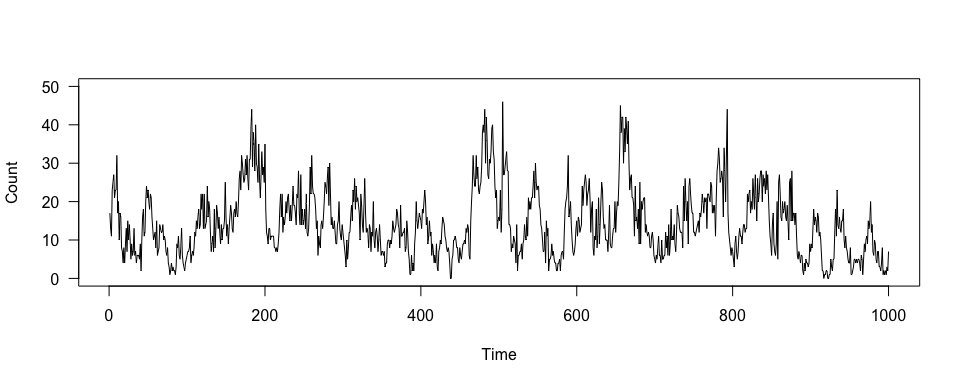
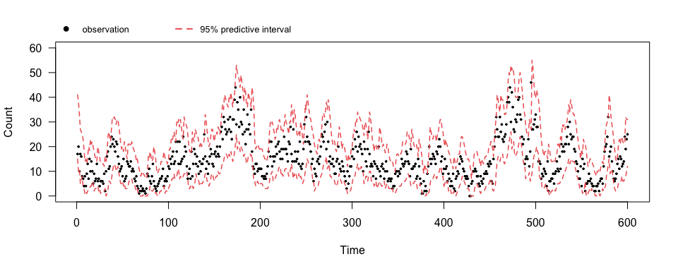

<!-- README.md is generated from README.Rmd. Please edit that file -->

# mtd

<!-- badges: start -->

[](https://github.com/xzheng42/mtd/actions)
<!-- badges: end -->

The aim of `mtd` (developer’s version) is to facilitate the
implementation of a class of stationary mixture transition distribution
(MTD) models for non-Gaussian time series data.

## Installation

You can install the package with devtools.

``` r
devtools::install_github("xzheng42/mtd")
```

## Usage

The `mtd` package provides four categories of functions: model
simulation, model fitting, model checking and model prediction.

### Model simulation

-   `rMTD` simulates a time series from an MTD model with a
    pre-specified stationary marginal distribution.

### Model fitting

-   `tsMTD` fits an MTD model with a pre-specified stationary marginal
    distribution.

-   `tsRegMTD` fits a regression MTD model with a pre-specified
    stationary marginal distribution.

### Model checking

-   `rqrMTD` performs model checking for an MTD model using randomized
    quantile residuals.

### Model prediction

-   `predMTD` generates one-step ahead posterior predictive
    distributions.

## Example

### A naive example

Generate data

``` r
library(mtd)
set.seed(42)
# set up parameters
mtdorder <- 5
expDecay <- function(x, la) exp(-la*x)
weight <- expDecay(1:mtdorder, 1)
weight <- weight / sum(weight)
param <- list(la = 5, ga = 3, kap = 3, eta = 2)
ndata <- 1000
# generate data
simu <- rMTD(mtdorder = mtdorder, weight = weight, family = "negative binomial", 
             param = param, size = ndata)
obs <- simu$y
plot(obs, type = "l", xlab = "Time", ylab = "Count", las = 1, ylim = c(0, 50))
```



Fit an MTD model with a stationary negative binomial marginal
distribution

``` r
# set model order
mtdorder <- 10
# fit the model
prior <- list(u_th = 2, v_th = 2, u_psi = 6, v_psi = 2, u_kap = 2, v_kap = 1, 
              alpha = 1, alpha_0 = 5, a_G0 = 1, b_G0 = 3)
starting <- list(kap = 2)
tuning <- list(se_kap = 0.15)
mcmc_param <- list(niter = 20000, nburn = 4000, nthin = 4)
res <- tsMTD(obs = obs, mtdorder = mtdorder, family = "negative binomial", 
             weight = "sb", prior = prior, tuning = tuning, starting = starting, 
             mcmc_param = mcmc_param)
```

Plot one-step ahead 95% posterior predictive intervals

``` r
# compute the interval
lags <- lagmat(obs, mtdorder)
trun_obs <- obs[-(1:mtdorder)]
probs <- c(0.025, 0.975)
pred_intv <- predMTD(res = res, family = "negative binomial", lags = lags, probs = probs)
# plot
par(mar = c(5.1, 4.1, 3.1, 2.1), xpd = TRUE)
plot(trun_obs[1:600], xlab = "Time", ylab = "Count", ylim = c(0, 60), las = 1,
     pch = 19, cex = 0.35)
lines(pred_intv[1, 1:600], col = "indianred2", lty = 2, lwd = 1.5)
lines(pred_intv[2, 1:600], col = "indianred2", lty = 2, lwd = 1.5)
legend("topleft", inset = c(0, -0.15), legend = c("observation", "95% predictive interval"), 
       pch = c(19, NA), lty = c(NA, 2), col = c("black", "indianred2"), bty = "n", 
       cex = 0.8, lwd = 2, horiz = TRUE)
```



### More examples

R code for more examples can be found in
<https://github.com/xzheng42/mtd-examples>.

## Reference

Zheng, X., Kottas, A., and Sansó, B. (2021), “On Construction and
Estimation of Stationary Mixture Transition Distribution Models,”
[*arXiv:2010.12696*](https://arxiv.org/abs/2010.12696).
